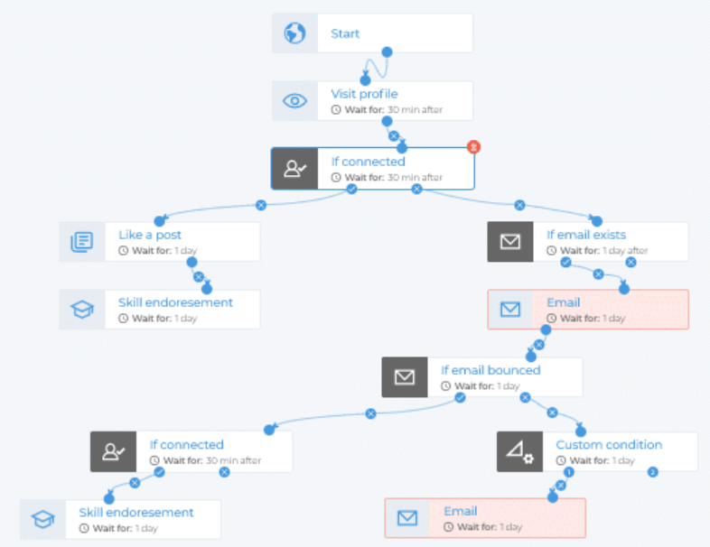

# первое

<iframe src="https://calendar.google.com/calendar/embed?src=19d93f5be02fc4004107f4a4470db4a76c10593d7a55f7a8be72ea7c19cc6817%40group.calendar.google.com&ctz=Asia%2FTbilisi" style="border: 0" width="800" height="600" frameborder="0" scrolling="no"></iframe>

⛔ описание из des

<i class="fa-regular fa-circle-xmark"></i>
# второе

# skr4

-----------------------------

- список
	- два 
	- три ♦

==выделение==

_курсив_

__жирный__

`определение`

> t45345646 653464563 
> er5454545y4
>>    5454545454
>> 				56565656

>[!FAQ] новое111
> - текст 1 
> - It supports **markdown** and [wikilinks](Internal%20link).

> [!NOTE] Title
> Contents

😂😂😂😂😂😂😂😂 

---

<iframe width="400" height="300" src="https://www.youtube.com/embed/NnTvZWp5Q7o"></iframe>

кекекекекекекеке

<iframe width="100%" height="400" src="https://docs.google.com/document/d/e/2PACX-1vS9AfDDCl79MKrXEqohPFVgw0cRTBn1gvSTrsYQP58ngf8YJ5IIhov3pGTwzVGpmNvqpwEYV1idbQ7U/pub?embedded=true"></iframe>

<iframe border=0 frameborder=0 height=300 width=500 src="https://twitframe.com/show?url=https%3A%2F%2Ftwitter.com%2Fjack%2Fstatus%2F20"> </iframe>

# Chapters

🔸 хаотичность и глобальность

🔹 Если какие-то из этих ролей не представлены, это 

выапвапвап  вавававава прарвапрапрарп

ываываываыва  45454545папрапрапр  http://example.com/   вапвапвап

## 💡
Here is a simple footnote.
бесплатная. ^1
A footnote can also have multiple lines[^2].  

You can also use words, to fit your writing style more closely[^note].

почему  он ушел ♦

вапвапвапва[^3]

что сделал и что не сделал что не удалось
- [x] #739 ♦
- [ ] https:thub.com/octo-org/octo-repo/issues/740
- [x] Add delight to the experience when all tasks are complete :tada:

[^1]: My reference.
[^2]: Every new line should be prefixed with 2 spaces.  
  This allows some *blue* text. https://jeffreytse.net/ you to have a footnote with multiple lines.

| Tables        | Are           | Cool  |
| ------------- |:-------------:| -----:|
| col 3 is      | right-aligned | $1600 |
| col 2 is      | centered      |   $12 |
| zebra stripes | are neat      |    $1 |

кликабельная картинка или видео

неопубликованная часть
%% вапрвапрвапапр
🟠🟡🟢🔵🟣🟨
%%

# изучить

# ▪ изучить
# ▫ осторожно ⛔
# нове  🔥
достижения 🚩

# важно ⚡
# ⭐избранное 
## книги 📗
## ✅ сделано
## время 🕒
## напоминание 🔔
## ▫ пункт
## идея  и совет 💡
## обсудим или цитаты 💬
## ❌ ошибки
## 🔻 раскрыть
	

some *blue* text.

<figure markdown>
  { width="100" }
</figure>

# лучшее

:octicons-heart-fill-24:{ .heart }

:fontawesome-brands-twitter:{ .twitter }

:material-test-tube:

Section Two 

#### metadata

- Type:: #123

- Status:: #edit 
- Location:: #пк
- Project:: 
- Topic:: 
- Back link:: [Техники `BA`](../../Техники%20`BA`.md)
- Source:: 
____________
🔻​

[`pop`](exemple.md#+pop){ #+pop }

--------           -------  --------            ---------

> [!warning]-

> [!example] 
> Lorem ipsum dolor sit amet

> [!quote] 
> Lorem ipsum dolor sit amet

> [!abstract] метадата
> Type:: #ttt
> Status:: #edit 
> Location:: #пк
> 
> Project:: 
> 
> Topic:: 
> Back link:: [Техники `BA`](../../Техники%20`BA`.md)
> Source:: 

> [!info] ссылки

> [!success] что успел и чего не успел

> [!question] мои советы 

> [!failure]- мои ошибки
> 1. не ходить а ехать

> [!danger] Лучше не делать
>  - песто 1
>  - тесто 2

> [!warning] Важные мелочи
>  [Subscribe to our newsletter](exemple.md#){ .md-button }

<!--nav-->

> [!bug]- чем я недоволен
> <iframe src="https://www.openstreetmap.org/export/embed.html?bbox=14.465005695819857%2C45.32756626493193%2C14.46918457746506%2C45.32927471428796&amp;layer=mapnik&amp;marker=45.32842049605121%2C14.467095136642456" style="border: 1px solid black; width: 100%; height: 25rem"></iframe>

> [!TIP]- Метадата
>

# гитхаб 

  

:bootstrap-envelope-paper:
:bootstrap-envelope-paper:
:bootstrap-envelope-paper:

[Send :fontawesome-solid-paper-plane:](exemple.md#){ .md-button }

[Subscribe to our newsletter](exemple.md#){ .md-button }

[Image title](https://dummyimage.com/600x400/eee/aaa){ align=right }

++ctrl+alt+del++

[=0% "0%"] [=5% "5%"]

<iframe src="https://docs.google.com/presentation/d/e/2PACX-1vQN9Yfr_u91SmgtZu7thDMW189jACj0u04nsX75jIES49BKjZUIQaXTCsksWAYt7REdweglWvt8NFpZ/embed?start=false&loop=false&delayms=1000" frameborder="0" width="640" height="380" allowfullscreen="true" mozallowfullscreen="true" webkitallowfullscreen="true"></iframe>

<iframe src="https://drive.google.com/file/d/1SnYmsHMD3c6X5zUo9Z-640QIyKZkCOnh/preview" width="640" height="480" allow="autoplay"></iframe>

<h5 align="center">
How To Reach Me
</h5>

    
    
        
    

    

    

    
 • I'm information security consultant - specialized in web application and penteration testing

    
 • I like experimenting with technologies, building small projects, automate everything.

    
 • Passionate about security, linux, dockers, electronics(IoT), coding, open-source and knowledge

    
 • I'm the owner and the maintener of a <a href='https://3os.org'>3os.org</a> knowledge-base website

